# 在unity中使用按钮切换场景并在新场景播放音乐

##  1 创建一个3D 新项目

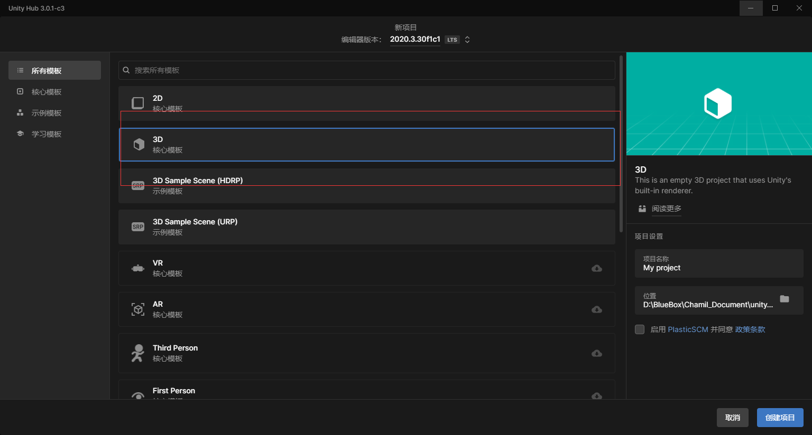

## 2 创建两个场景（Scenes）
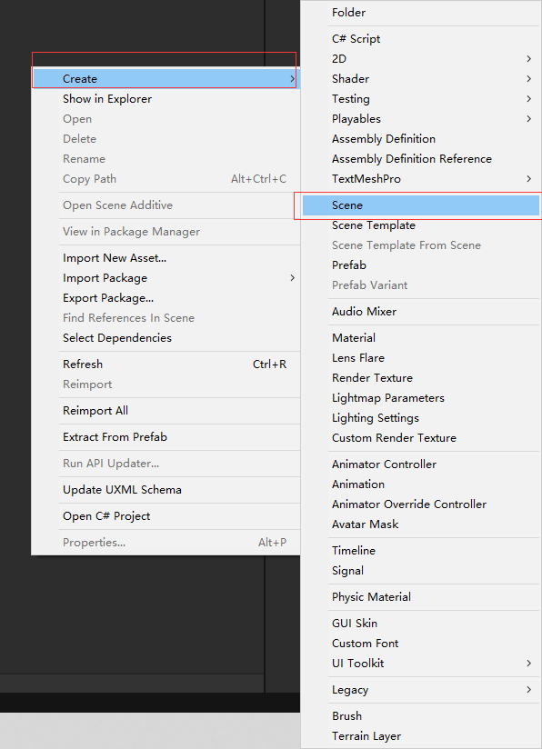

    因创造项目会默认生成一个场景SampleScene，因此只需要创建一个场景，本次创建的场景为002

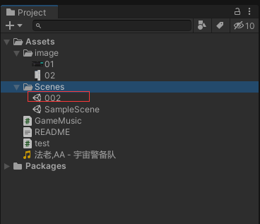

## 3 创建两个C# 脚本（Script）
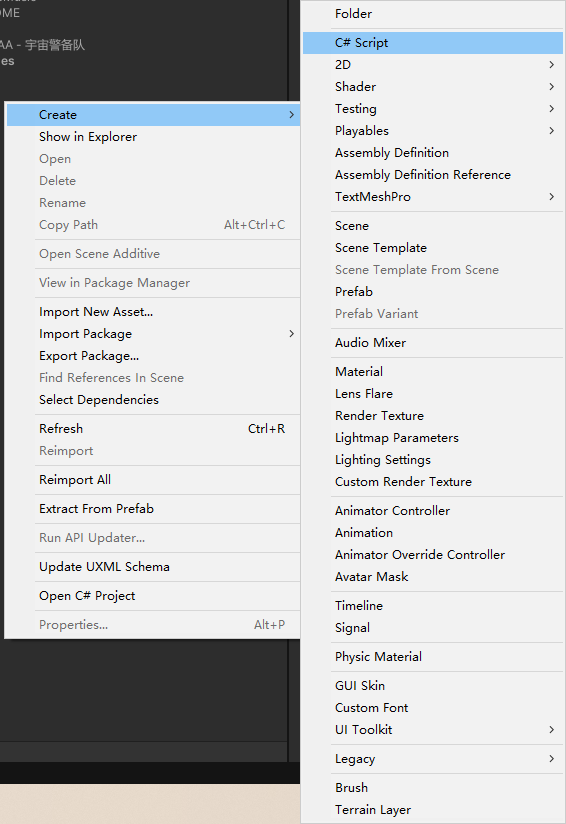

    本次创建两个，名称分别为test 和 GameMusic，test用于按钮跳转新场景，GameMusic用于进入新场景后播放音乐

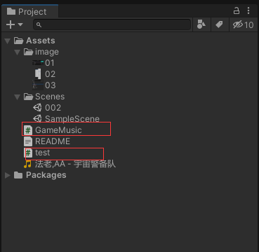

## 4 点击File-> Build Settings 
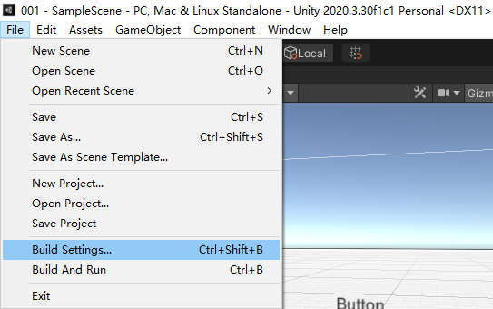
 
    将需要跳转的场景（002）拖入，然后关闭
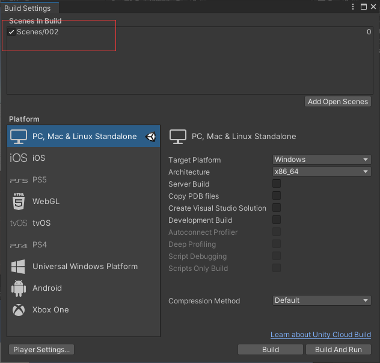

## 5 在SampleScene场景下创建按钮
    双击Scenes下的SampleScene，进入该场景，右击创建button

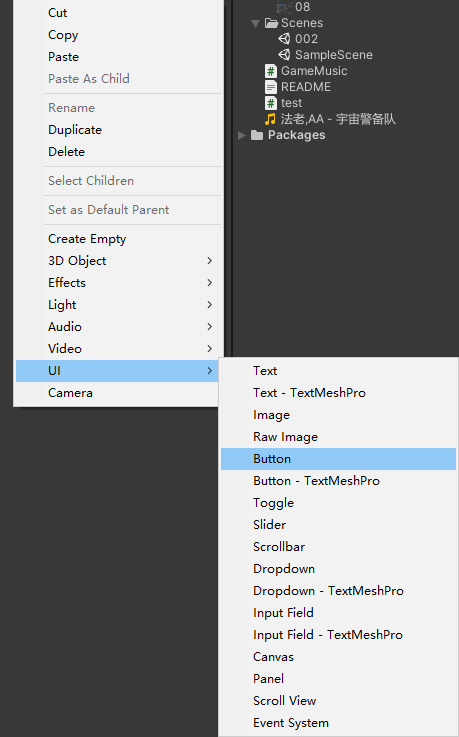

    会自动生成一个“Canvas”文件夹，Button存在其中，位置自行调节

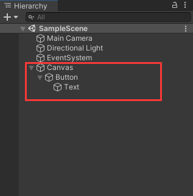

## 6 将test脚本拖拽到Button
    Button属性栏会多出一栏脚本
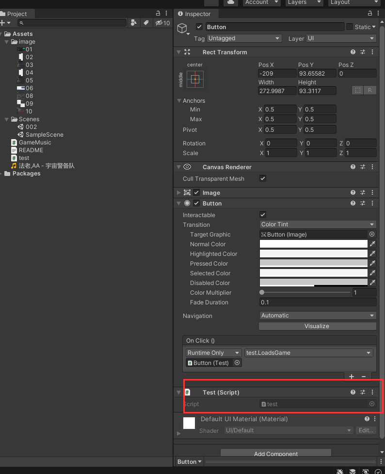

## 7 编写test脚本

```buildoutcfg
using System.Collections;
using System.Collections.Generic;
using UnityEngine;
using UnityEngine.SceneManagement;

public class 001 : MonoBehaviour
{
    public void LoadsGame()
    {
        SceneManager.LoadScene(0);
    }
}
```
    0 代表Build Settings 中右侧的数字 0


## 8 将test事件放入Button中
    点击Button属性栏中On Click() 中的 + 号

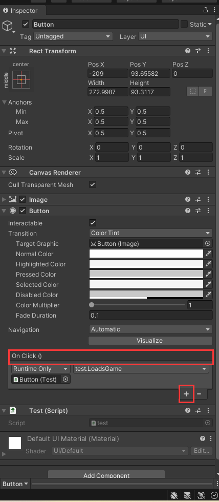

    然后将Button拖入到“Runtime Only”下边带圆的方格中，在右侧的选择栏中选择之前写好的test文件中的“LoadsGame函数”

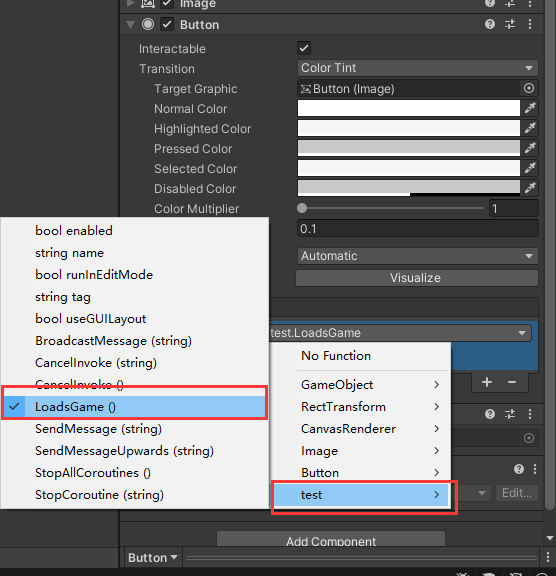 


## 9 选择场景002，创建空物体
    右击选择“Create Empty”，创建空物体，并重命名为“GameMusic”，
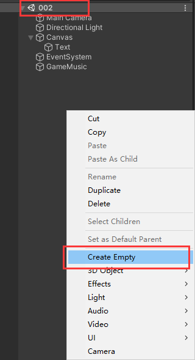 

## 10 打开GameMusic属性板，添加组件
    点击“Add Component”，选择“Audio Source”，生成组件后，将游戏音乐拖入“AudioClip”，本次拖入的音乐为“宇宙警卫队”（音乐需要先放入工程中）

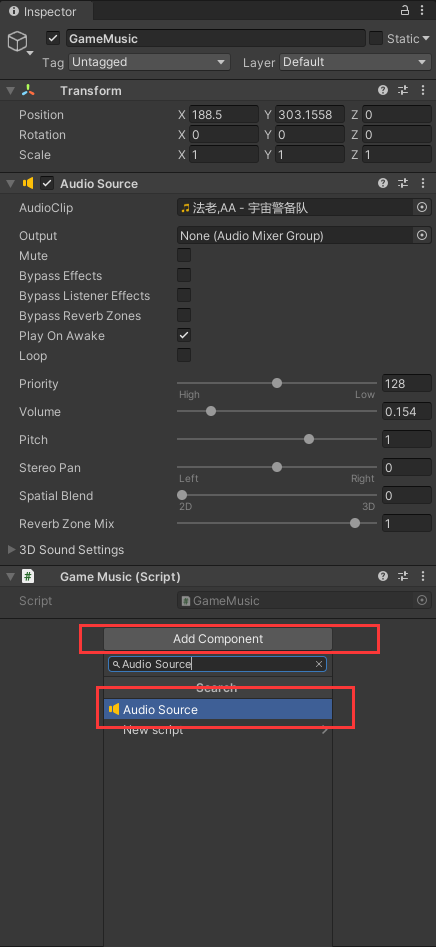 

## 11 将GameMusic脚本拖入之前创建的GameMusic物体中
    属性面板上会显示脚本组件
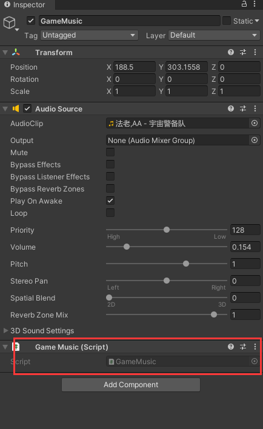 
    
    对GameMusic脚本进行编辑
```buildoutcfg
using System.Collections;
using System.Collections.Generic;
using UnityEngine;

public class GameMusic : MonoBehaviour
{
    private static GameMusic instance;
    private void Awake()
    {
        instance = this;
        DontDestroyOnLoad(this.gameObject);
    }
}

```

## 12 点击运行，显示结果


<video id="video" controls="" preload="none">
    <source id="mp4" src="image/video.mp4" type="video/mp4">
</video>

