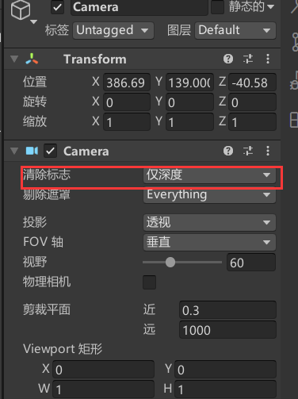

# 20220402Test

### 说明

1 如何使用多个摄像机交叠所拍摄物体

2 熟悉包管理器下载的预设demo

### 内容

1 使用多个摄像机拍摄的物品放置在同一个画面中，只需将除最底层的相机属性中的“Camera”中的“清除标志”设置为“仅深度”，最底层的摄像机中的设置为自己所需的背景

2 预设资源可以使用的目前只有各种资源的图片以及进度条，因为图片大多为png和ico等非矢量图片，因此在非正常尺寸下会出现毛边等情况，仅作为辅助使用。

    因学习unity仅作为上位机来使用，故而学习的重点应是对于各种协议脚本的编写而非ui设计的界面，没精力太花哨，风格和各种图标统一使用unity自带的黑色模式来进行，避免没有思路。
