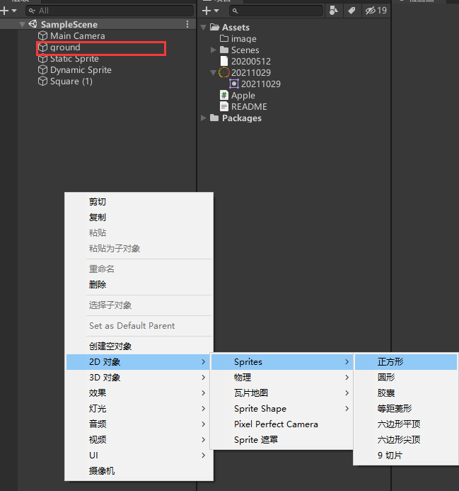
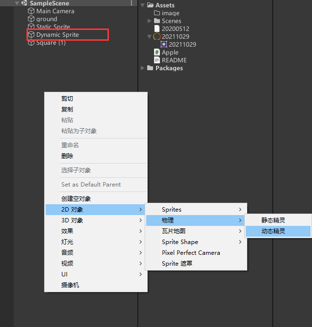
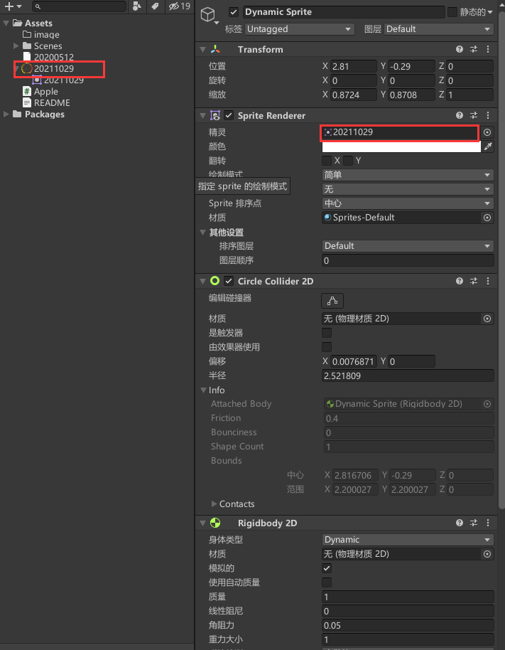
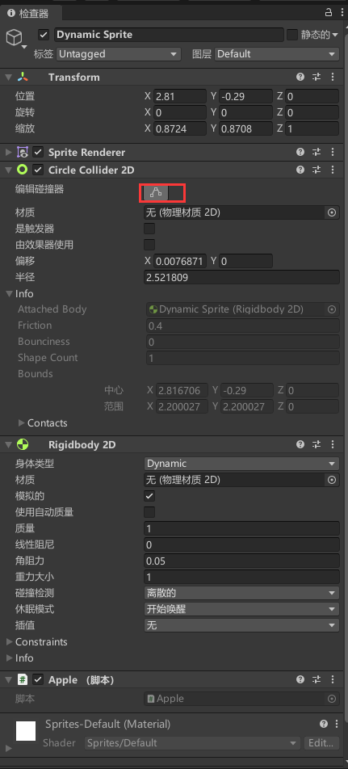
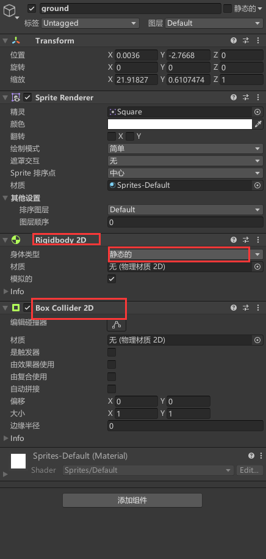

# 20220407 

## 说明
在2d下，如何使用鼠标拖拽移动物体

## 内容
1. 创建一个长方体，并命令为“ground”

2. 创建一个动态精灵，用来存放圆形图形

3. 将自定义图片放入其中

4. 静态精灵自带了2D圆形碰撞器（Circle collider 2D）和 2D刚体（Rigidbody 2D），但是如果添加的是普通的2d图形，则需要自行添加。

    圆形碰撞器需要点击 “编辑碰撞器”的图标，点击shift自行调节大小

    

5. 给“ground”添加一个2d刚体插件，并将“身体类型”设置为“静态的”，添加一个2D盒装碰撞器

6. 依次添加多个，核心是刚体和碰撞器，地面的刚体是静态的
7. 添加鼠标点击产生的脚本“Apple”
~~~ C# 
using System.Collections;
using System.Collections.Generic;
using UnityEngine;

public class Apple : MonoBehaviour
{
    Vector2 mousePos;
    Vector2 distance;
    Rigidbody2D rb2D;

    private void Start()
    {
        rb2D = GetComponent<Rigidbody2D>();
    }

    private void Update()
    {
        //获取鼠标位置的世界坐标
        mousePos = Camera.main.ScreenToWorldPoint(Input.mousePosition);
    }

    private void OnMouseDown()
    {
        //获取苹果与鼠标的位置差
        distance = new Vector2(transform.position.x, transform.position.y) - mousePos;
    }

    //当在碰撞器范围内按到鼠标时
    private void OnMouseDrag()
    {
        //更新苹果位置
        transform.position = mousePos + distance;
        //消除重力影响
        rb2D.gravityScale = 0;
        //速度设置为0
        rb2D.velocity = Vector2.zero;
    }

    //当在同一碰撞器范围内松开鼠标时
    private void OnMouseUpAsButton()
    {
        //恢复重力对苹果的影响
        rb2D.gravityScale = 3;
    }
}

~~~

核心： 这不是重点，重点是协议-_-, 以后别玩了
