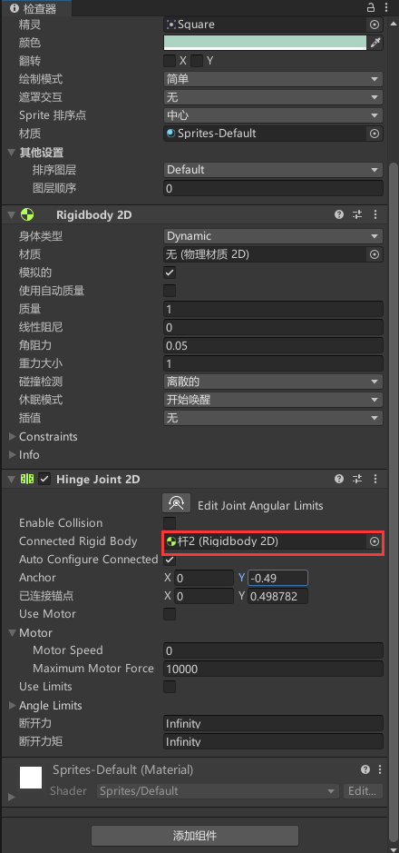

# 20220409

## 说明
在2d下，如何让面板渐显和渐隐

制作曲柄连杆模拟

## 内容
1. 创建一个面板Panel

2. 将面板图像的不透明度设置为0

    

3. 创建脚本Panel
```c#
using System.Collections;
using System.Collections.Generic;
using UnityEngine;
using UnityEngine.UI;

public class Panel : MonoBehaviour
{
    //声明一个图像组件存储面板的图像
    public Image panelImage;
    //声明一个动画曲线储存显示动画曲线
    public AnimationCurve showCurve;
    //声明一个动画曲线储存隐藏动画曲线
    public AnimationCurve hideCurve;
    //声明一个浮点数储存动画的播放速率
    public float animationSpeed;

    //声明一个协程方法用于显示面板
    IEnumerator showPanel()
    {
        //初始化一个计时器
        float timer = 0;
        //当面板图像的不透明度小于1时进行循环
        while(panelImage.color.a < 1)
        {
            //面板图像的不透明度等于显示动画曲线上对应计时器时间点的值
            panelImage.color = new Vector4(1, 1, 1, showCurve.Evaluate(timer));
            //增加计时器时间
            timer += Time.deltaTime * animationSpeed;
            //等待一帧
            yield return null;
        }
    }

    //声明一个协程方法用于隐藏面板
    IEnumerator hidePanel()
    {
        //初始化一个计时器
        float timer = 0;
        //当面板图像的不透明度大于0时进行循环
        while (panelImage.color.a > 0)
        {
            //面板图像的不透明度等于显示动画曲线上对应计时器时间点的值
            panelImage.color = new Vector4(1, 1, 1, hideCurve.Evaluate(timer));
            //增加计时器时间
            timer += Time.deltaTime * animationSpeed;
            //等待一帧
            yield return null;
        }
    }

    private void Update()
    {
        //按下鼠标左键
        if(Input.GetMouseButtonDown(0))
        {
            //停止所有协程
            StopAllCoroutines();
            //运行显示面板协程
            StartCoroutine(showPanel());
        }
        //按下鼠标右键
        else if (Input.GetMouseButtonDown(1))
        {
            //停止所有协程
            StopAllCoroutines();
            //运行隐藏面板协程
            StartCoroutine(hidePanel());
        }
    }
}

``` 

4. 将脚本添加到panel面板中

    

    panel image ：将面板panel拖入

    Show Curve：

    

    Hide Curve：

    

    Animation Speed 设置为2


5. 添加5个2d正方体，分别命名

    

6. 将wall1 wall2 添加静态刚体和盒装碰撞器

    

7. 对杆2添加刚体以及2d铰链（Hinge joint 2D）
    
    铰链勾选使用马达，速率为470

    

    对局部空间锚设置为“杆2”的底部

    

    

8. 对杆1添加刚体以及2d铰链（Hinge joint 2D）

    连接的刚体设置为“杆2”

    


    对局部空间锚设置为“杆1”和“杆2”的连接处

    

    


9. 对“活塞”添加刚体以及2d铰链（Hinge joint 2D）以及盒装碰撞器

    连接的刚体设置为“杆1”

    

    对局部空间锚设置为“杆2”和“活塞”的连接处

    

    