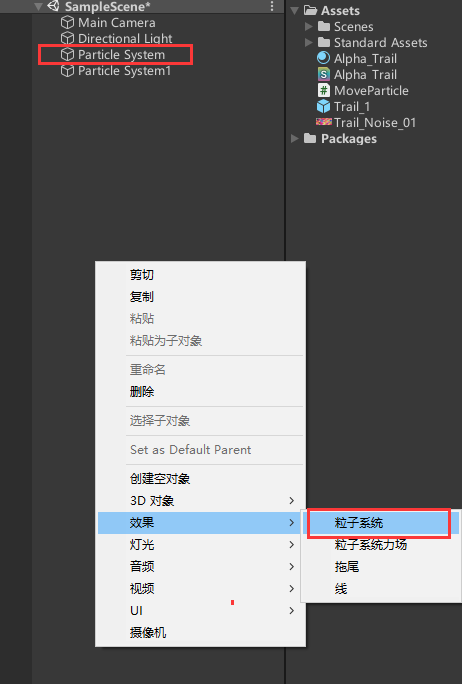
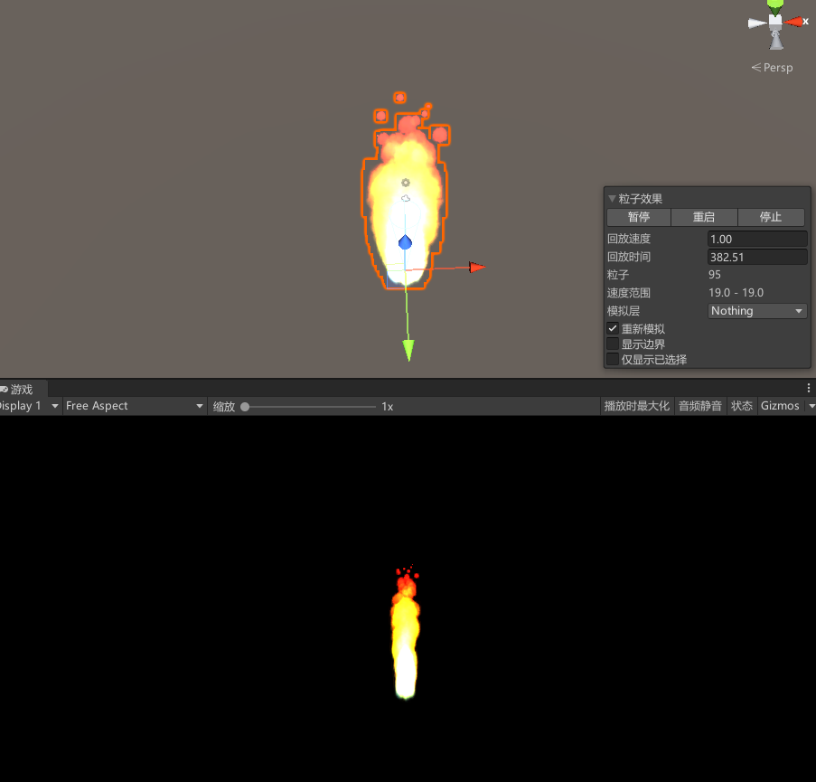
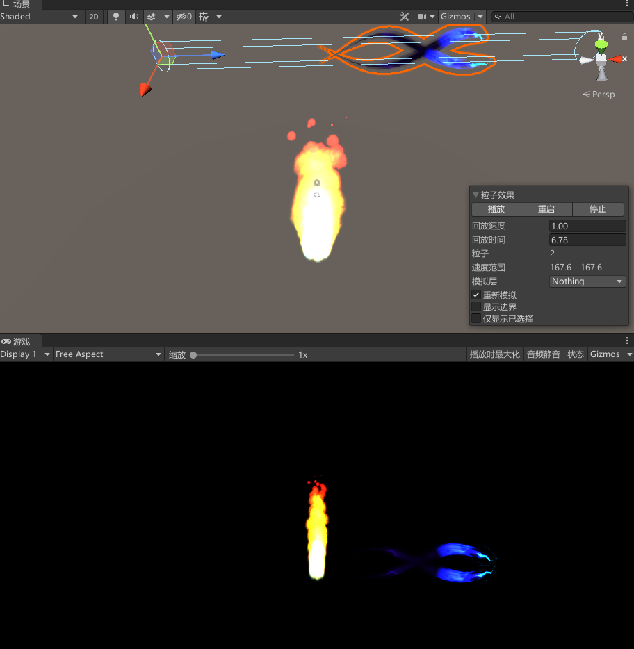

# 20220409

## 说明

粒子系统的简单使用

创建一个火焰效果

创建一个螺旋拖尾

## 内容
1. 创建一个粒子系统

    

2. 按照工程设置粒子系统参数

    最做效果如下

     

3. 再创建一个粒子系统

4. 配置托选拖尾参数

    

5. 设置火焰可以跟随鼠标移动

```C#
using System.Collections;
using System.Collections.Generic;
using UnityEngine;

public class MoveParticle : MonoBehaviour
{
    ParticleSystem m_ParticleSystem;

    Vector3 screenPosition;//将物体从世界坐标转换为屏幕坐标

    Vector3 mousePositionOnScreen;//获取到点击屏幕的屏幕坐标

    Vector3 mousePositionInWorld;//将点击屏幕的屏幕坐标转换为世界坐标

    // Start is called before the first frame update
    void Start()
    {
        m_ParticleSystem = GetComponent<ParticleSystem>();
    }

    // Update is called once per frame
    void Update()
    {
        //if (Input.GetMouseButtonDown(0))
        {
           
            //获取鼠标在相机中（世界中）的位置，转换为屏幕坐标；

            screenPosition = Camera.main.WorldToScreenPoint(transform.position);

            //获取鼠标在场景中坐标

            mousePositionOnScreen = Input.mousePosition;

            //让场景中的Z=鼠标坐标的Z

            mousePositionOnScreen.z = screenPosition.z;

            //将相机中的坐标转化为世界坐标

            mousePositionInWorld = Camera.main.ScreenToWorldPoint(mousePositionOnScreen);

            //print("x");
            //print(mousePositionInWorld.x);
            //print("y");
            //print(mousePositionInWorld.y);
            //print("z");
            //print(mousePositionInWorld.z);

            m_ParticleSystem.transform.position = mousePositionInWorld;
        }
    }

}


```

实际情况实际配置参数

螺旋拖尾贴图文件为条带单贴图.unitypackage

螺旋拖尾来源

    https://www.bilibili.com/video/BV1D54y1k7hs?spm_id_from=333.337.top_right_bar_window_default_collection.content.click

